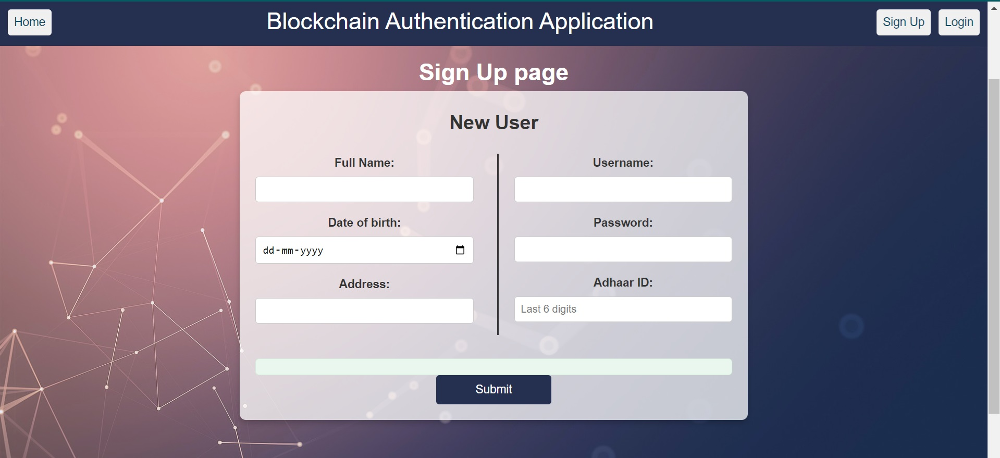
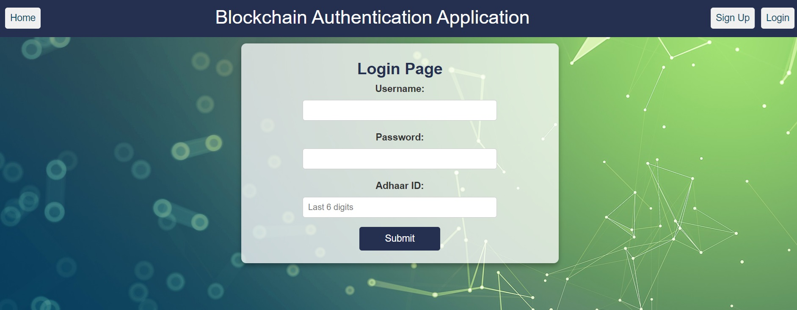

A simple authentication program using blockchain to store the user details hash in a smart contract and authenticate using user account from metamask and credentials.

# 🔐 Blockchain Authentication Application

A decentralized authentication system that uses **Blockchain**, **Smart Contracts (Solidity)**, and a **React** front-end to provide secure, transparent, and tamper-proof identity verification. This project aims to eliminate the vulnerabilities of traditional username-password systems by leveraging the immutability and transparency of blockchain technology.

## 🚀 Project Overview

Traditional authentication systems rely on centralized servers, which are prone to data breaches, phishing, and insider threats. This application introduces a **blockchain-based user authentication system** where user credentials and identity verification are managed through **smart contracts**, enhancing trust, decentralization, and security.

### ✅ Key Features

- 🔐 **User Registration & Login** via blockchain
- 🧾 **Data stored on-chain** using smart contracts
- 👁️ **Immutable and Transparent** authentication logic
- ⚙️ Built with **Solidity**, **React**, **Node.js**, **Web3.js**
- 📄 Simple front-end UI for sign-up and login
- 🌐 Web3 integration with MetaMask

## 🛠️ Technologies Used

| Tech used | Purpose |
|------------|---------|
| **Solidity** | Writing smart contracts |
| **React** | Front-end web app |
| **Web3.js** | Interacting with Ethereum blockchain |
| **Node.js & npm** | Development environment |
| **Ganache, Truffle, Metamask** | Smart contract testing and Blockchain accounts |
| **VS Code** | Code editor |
| **HTML/CSS** | Styling the front-end |

# 📸 Screenshots
Sign Up Page

Login Page     

# 📌 Future Enhancements

- 🔄 Integrate off-chain storage (e.g., IPFS) for user metadata
- 🔑 Multi-factor authentication support
- 🧠 Role-based access control

# 📄 License
This project is licensed under the MIT License.

# ✨ Author
Sayantan Mondal
